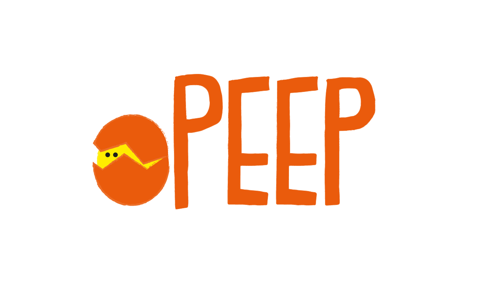

<h1>Peep, An Augmented Reality Game</h1>
<h3>Peep into a different world.</h3>

Created by: Valerie, Kieu, Sophia and Sabeeka at Technica Women's Hackathon 2019

 

 Peep is an augmented reality easter egg game where we provide hints and participants can locate the images. Once the camera senses the image, a 3d render will pop out. Peep is created with Unity with Vuforia.
